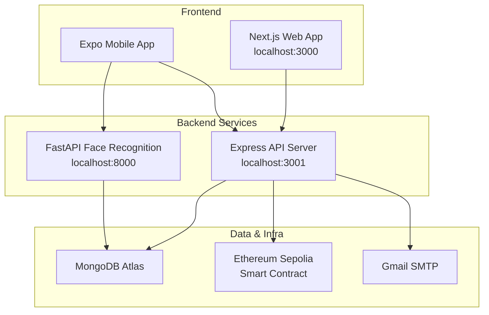

# 🚩 Kapit-Bisig — Full Project TODO & Audit

> **Generated:** July 25, 2026  
> **Scope:** Entire project — Web (Next.js + Express), Mobile (Expo), FastAPI Backend

---

## Quick Legend

| Symbol | Meaning |
|--------|---------|
| 🔴 | **Critical** — Blocks core functionality or is a security risk |
| 🟡 | **Important** — Should be done before any demo/deployment |
| 🟢 | **Nice to Have** — Polish, optimization, or future features |
| 🔗 | **Disconnected** — Code exists but isn't wired up |
| 🧪 | **Needs Testing** — Feature exists but isn't validated end-to-end |

---

## Project Architecture Overview

---

## 1. 🔴 Staff Dashboard — Entirely Mock Data (Web)

> [page.tsx](file:///c:/Users/Shekinah/Desktop/Kapit-Bisig/apps/web/apps/src/app/staff/dashboard/page.tsx) · [staff-dashboard components](file:///c:/Users/Shekinah/Desktop/Kapit-Bisig/apps/web/apps/src/components/staff-dashboard)

**The entire `/staff/dashboard` page uses hardcoded mock data.** Nothing hits the API.

| Item | Status |
|------|--------|
| Metric Strip (pending distributions, tasks, volunteers) | Hardcoded numbers |
| Priority Action Queue | Fake task objects |
| Recent Activity Feed | Static HTML |
| Quick Actions (Approve Users, Export, Log Claim, Broadcast SMS) | `showToast` stubs only |
| Announcements | Static text |

### TODO:
- [ ] 🔴 Connect `MetricStrip` to real distribution/claim stats from the Express server
- [ ] 🔴 Wire `ActionQueue` to actual pending tasks (review queue, unresolved claims)
- [ ] 🟡 Build a real Activity Feed — connect to `AuditLog` or `Notification` models
- [ ] 🟡 Wire Quick Actions to real navigation or API calls
- [ ] 🟡 Build an Announcements CRUD or connect to Notifications

---

## 2. 🔴 Dashboard — Hardcoded / Incomplete Values (Web)

> [dashboard/page.tsx](file:///c:/Users/Shekinah/Desktop/Kapit-Bisig/apps/web/apps/src/app/dashboard/page.tsx)

| Item | Issue |
|------|-------|
| `completedToday` | Always `0` — hardcoded on line 82 |
| `pendingWrites` | Always `0` — hardcoded on line 83 |
| Weekly claims chart | Derived from monthly data, not actual daily tracking |

### TODO:
- [ ] 🔴 Build/query a server endpoint for **completedToday** (distributions completed today)
- [ ] 🔴 Build/query a server endpoint for **pendingWrites** (pending blockchain writes or syncs)
- [ ] 🟡 Build real **daily claim tracking** endpoint for accurate weekly chart

---

## 3. 🔗 Models With No Frontend UI (Web)

> [models directory](file:///c:/Users/Shekinah/Desktop/Kapit-Bisig/apps/web/apps/server/models)

These Mongoose models exist and are used in backend routes, but have **no visible web UI**:

| Model | Used In Routes | Web UI |
|-------|---------------|--------|
| [AuditLog.ts](file:///c:/Users/Shekinah/Desktop/Kapit-Bisig/apps/web/apps/server/models/AuditLog.ts) | `householdRoutes`, `adminTokenRoutes` | ❌ No audit log viewer |
| [OfflineSyncQueue.ts](file:///c:/Users/Shekinah/Desktop/Kapit-Bisig/apps/web/apps/server/models/OfflineSyncQueue.ts) | `beneficiaryRoutes` | ❌ No sync status UI |
| [DistributionClaim.ts](file:///c:/Users/Shekinah/Desktop/Kapit-Bisig/apps/web/apps/server/models/DistributionClaim.ts) | `claimRoutes`, `distributionRoutes`, `householdRoutes`, `reportRoutes` | ❌ No dedicated claim detail view |
| [ResidentQrScanLog.ts](file:///c:/Users/Shekinah/Desktop/Kapit-Bisig/apps/web/apps/server/models/ResidentQrScanLog.ts) | `householdRoutes`, `authRoutes` | ❌ No scan history viewer |
| [RegistrationAuditLog.ts](file:///c:/Users/Shekinah/Desktop/Kapit-Bisig/apps/web/apps/server/models/RegistrationAuditLog.ts) | Registration flows | ❌ No registration audit trail view |

### TODO:
- [ ] 🟡 Build **Audit Log Viewer** page for superadmins (table + filters + export)
- [ ] 🟡 Build **QR Scan History** view (who scanned what, when, where)
- [ ] 🟡 Decide: Is `OfflineSyncQueue` needed on web? If mobile-only, document it
- [ ] 🟢 Add **Registration Audit Trail** panel inside the resident review modal

---

## 4. 🟡 Notification System — Backend Done, Frontend Partial (Web + Mobile)

> **Server:** [notificationRoutes.ts](file:///c:/Users/Shekinah/Desktop/Kapit-Bisig/apps/web/apps/server/routes/notificationRoutes.ts), [createNotification.ts](file:///c:/Users/Shekinah/Desktop/Kapit-Bisig/apps/web/apps/server/utils/createNotification.ts)  
> **Web:** [HeaderWidgets.tsx](file:///c:/Users/Shekinah/Desktop/Kapit-Bisig/apps/web/apps/src/components/layout/HeaderWidgets.tsx), [api.ts → notificationsApi](file:///c:/Users/Shekinah/Desktop/Kapit-Bisig/apps/web/apps/src/lib/api.ts#L938)  
> **Mobile:** Push notification setup in [App.tsx](file:///c:/Users/Shekinah/Desktop/Kapit-Bisig/mobile/App.tsx)

| Platform | Status |
|----------|--------|
| Server routes (CRUD) | ✅ Working |
| `createNotification()` utility | ✅ Working |
| Web — API client | ✅ Working |
| Web — Header bell dropdown | ✅ Working |
| Web — Real-time updates | ❌ Only loads on page refresh |
| Web — Full notifications page | ❌ Doesn't exist |
| Mobile — Push notification receiver | ⚠️ Setup code in `App.tsx` but no end-to-end flow |
| Server — Push notification sender (Expo) | ❌ Not implemented |

### TODO:
- [ ] 🟡 **Web:** Verify all key actions create notifications (distribution created, claim recorded, resident approved/rejected, proof reviewed)
- [ ] 🟡 **Web:** Add real-time notification polling or WebSocket
- [ ] 🔴 **Mobile:** Implement server-side Expo push notification sending
- [ ] 🔴 **Mobile:** Complete the push notification receiver → display flow
- [ ] 🟢 **Web:** Build a full Notifications page

---

## 5. 🟡 Blockchain — Backend Records Hashes, No UI Anywhere (Web)

> **Server:** [claimRoutes.ts](file:///c:/Users/Shekinah/Desktop/Kapit-Bisig/apps/web/apps/server/routes/claimRoutes.ts), [Claim.ts](file:///c:/Users/Shekinah/Desktop/Kapit-Bisig/apps/web/apps/server/models/Claim.ts)  
> **Env:** `CONTRACT_ADDRESS`, `RPC_URL`, `NEXT_PUBLIC_TX_EXPLORER_BASE_URL` in [.env.local](file:///c:/Users/Shekinah/Desktop/Kapit-Bisig/apps/web/apps/.env.local)

| Item | Status |
|------|--------|
| Claims write blockchain hashes to MongoDB | ✅ |
| `NEXT_PUBLIC_TX_EXPLORER_BASE_URL` configured | ✅ |
| Transaction hash shown in web UI | ❌ |
| "Verify on Blockchain" link | ❌ |

### TODO:
- [ ] 🟡 Show **blockchain tx hash** and **Etherscan link** in Distribution details / claim views
- [ ] 🟡 Add a **"Verify on Blockchain"** button for each claimed household
- [ ] 🟢 Add blockchain verification info to the Reports page

---

## 6. 🔴 Mobile ↔ Server Integration Gaps

> **Mobile Services:** [ResidentQrService.ts](file:///c:/Users/Shekinah/Desktop/Kapit-Bisig/mobile/services/api/ResidentQrService.ts), [MobileAuthService.ts](file:///c:/Users/Shekinah/Desktop/Kapit-Bisig/mobile/services/auth/MobileAuthService.ts), [VerificationAPIService.ts](file:///c:/Users/Shekinah/Desktop/Kapit-Bisig/mobile/services/api/VerificationAPIService.ts), [FaceRecognitionApi.ts](file:///c:/Users/Shekinah/Desktop/Kapit-Bisig/mobile/services/api/FaceRecognitionApi.ts)  
> **Server:** [authRoutes.ts](file:///c:/Users/Shekinah/Desktop/Kapit-Bisig/apps/web/apps/server/routes/authRoutes.ts) (mobile-auth)

| Feature | Mobile | Express Server | Connected? |
|---------|--------|---------------|------------|
| Resident registration | ✅ `RegisterScreen.tsx` | ✅ `residentRoutes.ts` | ✅ |
| QR code claim scanning | ✅ `VolunteerQRScannerScreen.tsx` | ✅ `claimRoutes.ts` | ✅ |
| Face recognition verify | ✅ `FaceRecognitionApi.ts` | ✅ `faceRoutes.ts` + FastAPI | 🧪 |
| Proof submission | ✅ `ResidentProofRequestScreen.tsx` | ✅ `beneficiaryRoutes.ts` | ✅ |
| Registration revision | ✅ `ResidentRegistrationRevisionScreen.tsx` | ✅ `residentRoutes.ts` | ✅ |
| Offline claim sync | ❌ Not in mobile | ✅ `OfflineSyncQueue` model | 🔗 |
| Push notifications | ⚠️ Receiver only | ❌ No Expo push sender | 🔗 |
| Volunteer dashboard | ✅ `VolunteerDashboardScreen.tsx` | ✅ Routes exist | 🧪 |
| Profile screen | ✅ `ProfileScreen.tsx` | ✅ `profileRoutes.ts` | 🧪 |
| QR receipt screen | ✅ `QRReceiptScreen.tsx` | ✅ Claim data available | 🧪 |

### TODO:
- [ ] 🔴 Implement **Expo push notification** server-side sending
- [ ] 🟡 Either implement **mobile offline claim queue** or remove `OfflineSyncQueue` model
- [ ] 🧪 End-to-end test **face recognition pipeline** (Mobile → Express → FastAPI → DeepFace → back)
- [ ] 🧪 End-to-end test **proof submission** → admin review flow
- [ ] 🧪 End-to-end test **volunteer dashboard** data accuracy
- [ ] 🧪 End-to-end test **QR receipt** display after claim

---

## 7. 🔴 FastAPI Backend — Environment & Integration

> [main.py](file:///c:/Users/Shekinah/Desktop/Kapit-Bisig/backend/main.py) (1801 lines), [.env.example](file:///c:/Users/Shekinah/Desktop/Kapit-Bisig/backend/.env.example)

| Item | Status |
|------|--------|
| Face verification endpoint | ✅ |
| Face registration (embedding storage) | ✅ |
| Duplicate face detection | ✅ |
| MongoDB integration | ✅ |
| Actual `.env` file | ❓ Only `.env.example` exists |
| MongoDB URI alignment with Express | ❓ `.env.example` points to local MongoDB; Express uses Atlas |
| CORS allowlist | ✅ Configurable via `FACE_API_ALLOWED_ORIGINS` |
| Admin token auth | ✅ `FACE_API_ADMIN_TOKEN` |
| Benchmark scripts | ✅ `_bench_lowlight`, `_bench_verify`, `eval_results` |
| Test scripts | ✅ `test_face_duplicate.py`, `test_mongodb_save.py`, `test_verify_face_matching_table.py` |

### TODO:
- [ ] 🔴 Ensure FastAPI `.env` MongoDB URI matches Express Atlas URI (or document the intentional difference)
- [ ] 🔴 Create actual `.env` from `.env.example` if not done
- [ ] 🟡 Document how to run FastAPI alongside Express in development (startup order, ports)
- [ ] 🟡 Modularize `main.py` (1801 lines) — extract into FastAPI routers
- [ ] 🧪 Run benchmark/eval scripts and verify face recognition accuracy meets threshold
- [ ] 🟢 Consider if FastAPI can share the same MongoDB database as Express or needs isolation

---

## 8. 🔴 Security Concerns

> [.env.local](file:///c:/Users/Shekinah/Desktop/Kapit-Bisig/apps/web/apps/.env.local) · [SECURITY_CHECKLIST.md](file:///c:/Users/Shekinah/Desktop/Kapit-Bisig/docs/SECURITY_CHECKLIST.md)

| Item | File | Line | Risk |
|------|------|------|------|
| Ethereum private key in plaintext | `.env.local` | L32 | 🔴 Can drain wallet |
| Gmail SMTP app password | `.env.local` | L45 | 🔴 Can send emails from your account |
| MongoDB Atlas connection string w/ password | `.env.local` | L8 | 🔴 Full DB access |
| JWT secret | `.env.local` | L12 | 🔴 Can forge auth tokens |
| Trailing stray `o` character | `.env.local` | L47 | 🟢 Cleanup |

### TODO:
- [ ] 🔴 Confirm `.env.local` is in `.gitignore` (verify it's not committed)
- [ ] 🟡 For production: move all secrets to a secret manager or hosting platform env vars
- [ ] 🟡 Audit `RevokedToken` cleanup — no TTL/cron found to purge expired tokens
- [ ] 🟡 Run the Postman/Newman security test suite (`npm run test:auth:newman`)
- [ ] 🟢 Remove stray `o` from `.env.local` line 47

---

## 9. 🔗 Legacy / Dead Code

| Item | File | Issue |
|------|------|-------|
| `superadminAuthRoutes.ts` | [superadminAuthRoutes.ts](file:///c:/Users/Shekinah/Desktop/Kapit-Bisig/apps/web/apps/server/routes/superadminAuthRoutes.ts) | Defined but **not mounted** — "disabled to prevent bypassing unified OTP flow" |
| Duplicate user table components | [UserTable.tsx](file:///c:/Users/Shekinah/Desktop/Kapit-Bisig/apps/web/apps/src/components/users/UserTable.tsx) + [UsersTable.tsx](file:///c:/Users/Shekinah/Desktop/Kapit-Bisig/apps/web/apps/src/components/users/UsersTable.tsx) | Two similar components |
| `/verify-residents` redirect | [verify-residents/page.tsx](file:///c:/Users/Shekinah/Desktop/Kapit-Bisig/apps/web/apps/src/app/verify-residents/page.tsx) | Just redirects to `/code-generation` |
| Expo log files in repo | [mobile/*.log](file:///c:/Users/Shekinah/Desktop/Kapit-Bisig/mobile) | 6 log files committed |
| `fix-colors.js` + `fix-colors.py` | [mobile/](file:///c:/Users/Shekinah/Desktop/Kapit-Bisig/mobile) | One-off utility scripts still in repo |

### TODO:
- [ ] 🟢 Delete or deprecate `superadminAuthRoutes.ts`
- [ ] 🟢 Consolidate `UserTable.tsx` and `UsersTable.tsx`
- [ ] 🟢 Remove `/verify-residents` redirect if not needed
- [ ] 🟢 Add `*.log`, `fix-colors.*` to `.gitignore` in mobile

---

## 10. 🟡 Testing Gaps — All Platforms

### Express Server Tests
> [server/test](file:///c:/Users/Shekinah/Desktop/Kapit-Bisig/apps/web/apps/server/test)

| Test | Status |
|------|--------|
| `distributionFlow.integration.ts` (11KB) | ✅ |
| `distributionFlow.unit.ts` | ✅ |
| `idScreening.unit.ts` | ✅ |
| `idVerification.unit.ts` | ✅ |
| `beneficiaryFlow.unit.ts` (1KB) | ⚠️ Stub only |
| Auth flow tests | ❌ |
| Notification tests | ❌ |
| Postman/Newman collection | ✅ Exists |

### FastAPI Tests
> [backend/](file:///c:/Users/Shekinah/Desktop/Kapit-Bisig/backend)

| Test | Status |
|------|--------|
| `test_face_duplicate.py` | ✅ |
| `test_mongodb_save.py` | ✅ |
| `test_verify_face_matching_table.py` | ✅ |
| `evaluate_lfw_pairs.py` (LFW benchmark) | ✅ |

### Frontend & Mobile
| Area | Status |
|------|--------|
| Web frontend component tests | ❌ None |
| Mobile screen tests | ❌ None |

### TODO:
- [ ] 🟡 Flesh out `beneficiaryFlow.unit.ts`
- [ ] 🟡 Add Express auth flow tests (login, OTP, forgot password)
- [ ] 🟡 Add Express notification creation tests
- [ ] 🟢 Add web frontend component tests for critical flows
- [ ] 🟢 Add mobile screen snapshot tests
- [ ] 🧪 Run FastAPI benchmark scripts and record results

---

## 11. 🟡 Code Quality — Oversized Files

### Web (Frontend)
| File | Size | Issue |
|------|------|-------|
| [ReportsPageClient.tsx](file:///c:/Users/Shekinah/Desktop/Kapit-Bisig/apps/web/apps/src/components/reports/ReportsPageClient.tsx) | 49KB | Split into sub-components |
| [NewDistributionModal.tsx](file:///c:/Users/Shekinah/Desktop/Kapit-Bisig/apps/web/apps/src/components/distribution/NewDistributionModal.tsx) | 34KB | Large modal |
| [TargetBeneficiariesPageClient.tsx](file:///c:/Users/Shekinah/Desktop/Kapit-Bisig/apps/web/apps/src/components/beneficiaries/TargetBeneficiariesPageClient.tsx) | 34KB | Could split |
| [HeaderWidgets.tsx](file:///c:/Users/Shekinah/Desktop/Kapit-Bisig/apps/web/apps/src/components/layout/HeaderWidgets.tsx) | 36KB | Very large header |

### Express Server
| File | Size | Issue |
|------|------|-------|
| [householdRoutes.ts](file:///c:/Users/Shekinah/Desktop/Kapit-Bisig/apps/web/apps/server/routes/householdRoutes.ts) | 77KB | Extract into service layer |
| [authRoutes.ts](file:///c:/Users/Shekinah/Desktop/Kapit-Bisig/apps/web/apps/server/routes/authRoutes.ts) | 38KB | Mobile & web auth mixed together |
| [beneficiaryService.ts](file:///c:/Users/Shekinah/Desktop/Kapit-Bisig/apps/web/apps/server/services/beneficiaryService.ts) | 33KB | Long service |
| [beneficiaryRoutes.ts](file:///c:/Users/Shekinah/Desktop/Kapit-Bisig/apps/web/apps/server/routes/beneficiaryRoutes.ts) | 31KB | Long route file |
| [householdRegistrationService.ts](file:///c:/Users/Shekinah/Desktop/Kapit-Bisig/apps/web/apps/server/services/householdRegistrationService.ts) | 30KB | Long service |
| [householdTokenService.ts](file:///c:/Users/Shekinah/Desktop/Kapit-Bisig/apps/web/apps/server/services/householdTokenService.ts) | 30KB | Long service |
| [unifiedAuthRoutes.ts](file:///c:/Users/Shekinah/Desktop/Kapit-Bisig/apps/web/apps/server/routes/unifiedAuthRoutes.ts) | 31KB | Long route file |

### Mobile
| File | Size | Issue |
|------|------|-------|
| [RegisterScreen.tsx](file:///c:/Users/Shekinah/Desktop/Kapit-Bisig/mobile/components/RegisterScreen.tsx) | **176KB** | Extremely large — must split |
| [SplashScreen.tsx](file:///c:/Users/Shekinah/Desktop/Kapit-Bisig/mobile/components/SplashScreen.tsx) | 37KB | Very large |
| [HomeScreen.tsx](file:///c:/Users/Shekinah/Desktop/Kapit-Bisig/mobile/components/HomeScreen.tsx) | 37KB | Very large |
| [ResidentProofRequestScreen.tsx](file:///c:/Users/Shekinah/Desktop/Kapit-Bisig/mobile/components/ResidentProofRequestScreen.tsx) | 37KB | Large |
| [VolunteerDashboardScreen.tsx](file:///c:/Users/Shekinah/Desktop/Kapit-Bisig/mobile/components/VolunteerDashboardScreen.tsx) | 32KB | Large |
| [ProfileScreen.tsx](file:///c:/Users/Shekinah/Desktop/Kapit-Bisig/mobile/components/ProfileScreen.tsx) | 29KB | Large |
| [VolunteerQRScannerScreen.tsx](file:///c:/Users/Shekinah/Desktop/Kapit-Bisig/mobile/components/VolunteerQRScannerScreen.tsx) | 29KB | Large |
| [ResidentQrService.ts](file:///c:/Users/Shekinah/Desktop/Kapit-Bisig/mobile/services/api/ResidentQrService.ts) | 25KB | Large service |

### FastAPI
| File | Size | Issue |
|------|------|-------|
| [main.py](file:///c:/Users/Shekinah/Desktop/Kapit-Bisig/backend/main.py) | 67KB / 1801 lines | Needs modularization into routers |

---

## 12. Missing Pages & Features Summary

### Web Pages
| Page | Route | Status |
|------|-------|--------|
| Dashboard | `/dashboard` | ✅ (hardcoded values — §2) |
| Login | `/login` | ✅ |
| Forgot Password | `/forgot-password` | ✅ |
| Manage Users | `/users` | ✅ |
| Resident Registration | `/resident-registration` | ✅ |
| Verified Residents | `/verified-residents` | ✅ |
| Code Generation | `/code-generation` | ✅ |
| Relief Registry | `/households` | ✅ |
| Distribution | `/distribution` | ✅ |
| Target Beneficiaries | `/target-beneficiaries` | ✅ |
| Reports | `/reports` | ✅ |
| Settings | `/settings` | ✅ |
| Staff Dashboard | `/staff/dashboard` | 🔴 All mock |
| **Audit Log Viewer** | — | 🔗 Missing |
| **Full Notifications Page** | — | 🔗 Missing |
| **Blockchain/Claim Proof View** | — | 🔗 Missing |

### Mobile Screens
| Screen | Status |
|--------|--------|
| Splash / Landing | ✅ |
| Login | ✅ |
| Register | ✅ |
| Home | ✅ |
| Profile | ✅ |
| QR Receipt | ✅ |
| Volunteer Dashboard | ✅ |
| Volunteer QR Scanner | ✅ |
| Proof Submission | ✅ |
| Registration Revision | ✅ |
| **Notification Center** | ❌ Missing |
| **Offline Mode Indicator** | ❌ Missing |

---

## 13. Cross-Service Integration Matrix

| Flow | Web → Express | Mobile → Express | Mobile → FastAPI | Status |
|------|:---:|:---:|:---:|--------|
| User auth (login/OTP/logout) | ✅ | ✅ | — | ✅ Working |
| Resident registration | ✅ (admin view) | ✅ (submission) | — | ✅ Working |
| Face registration | — | ✅ | ✅ | 🧪 Needs e2e test |
| Face verification (claim) | — | ✅ | ✅ | 🧪 Needs e2e test |
| QR claim scan | — | ✅ | — | ✅ Working |
| Distribution CRUD | ✅ | — | — | ✅ Working |
| Report generation | ✅ | — | — | ✅ Working |
| Blockchain claim hash | ✅ (writes) | — | — | 🔗 No UI |
| Push notifications | — | ⚠️ Receiver only | — | 🔗 No server sender |
| Proof submission | — | ✅ | — | ✅ Working |
| Proof review | ✅ | — | — | ✅ Working |
| Offline sync | — | ❌ | — | 🔗 Model exists, no implementation |
| Password change (OTP) | ✅ | — | — | ✅ Working |
| Forgot password | ✅ | — | — | ✅ Working |

---

## 14. Documentation Status

> [docs/](file:///c:/Users/Shekinah/Desktop/Kapit-Bisig/docs)

| Document | Status |
|----------|--------|
| [DOCS_INDEX.md](file:///c:/Users/Shekinah/Desktop/Kapit-Bisig/docs/DOCS_INDEX.md) | ✅ |
| [API_DOCUMENTATION.md](file:///c:/Users/Shekinah/Desktop/Kapit-Bisig/docs/API_DOCUMENTATION.md) | ✅ |
| [DATABASE_SCHEMA.md](file:///c:/Users/Shekinah/Desktop/Kapit-Bisig/docs/DATABASE_SCHEMA.md) | ✅ |
| [BACKEND_SETUP_GUIDE.md](file:///c:/Users/Shekinah/Desktop/Kapit-Bisig/docs/BACKEND_SETUP_GUIDE.md) | ✅ |
| [INTEGRATION_GUIDE.md](file:///c:/Users/Shekinah/Desktop/Kapit-Bisig/docs/INTEGRATION_GUIDE.md) | ✅ |
| [FACE_RECOGNITION_SYSTEM_DOCUMENTATION.md](file:///c:/Users/Shekinah/Desktop/Kapit-Bisig/docs/FACE_RECOGNITION_SYSTEM_DOCUMENTATION.md) | ✅ (66KB — thorough) |
| [MOBILE_FACE_RECOGNITION_IMPLEMENTATION_GUIDE.md](file:///c:/Users/Shekinah/Desktop/Kapit-Bisig/docs/MOBILE_FACE_RECOGNITION_IMPLEMENTATION_GUIDE.md) | ✅ (66KB — thorough) |
| [SECURITY_CHECKLIST.md](file:///c:/Users/Shekinah/Desktop/Kapit-Bisig/docs/SECURITY_CHECKLIST.md) | ✅ (46KB) |
| [SECURITY_RUBRIC_ASSESSMENT.md](file:///c:/Users/Shekinah/Desktop/Kapit-Bisig/docs/SECURITY_RUBRIC_ASSESSMENT.md) | ✅ |
| [RISK_MITIGATION_IMPLEMENTATION_REVIEW.md](file:///c:/Users/Shekinah/Desktop/Kapit-Bisig/docs/RISK_MITIGATION_IMPLEMENTATION_REVIEW.md) | ✅ |
| [TARGET_BENEFICIARY_IMPLEMENTATION.md](file:///c:/Users/Shekinah/Desktop/Kapit-Bisig/docs/TARGET_BENEFICIARY_IMPLEMENTATION.md) | ✅ |
| [MAINTENANCE_NOTES.md](file:///c:/Users/Shekinah/Desktop/Kapit-Bisig/docs/MAINTENANCE_NOTES.md) | ✅ |
| [WIFI_IP_CHANGE_CHECKLIST.md](file:///c:/Users/Shekinah/Desktop/Kapit-Bisig/docs/WIFI_IP_CHANGE_CHECKLIST.md) | ✅ |
| Postman collection + environment | ✅ |
| **Deployment guide** | ❌ Missing |
| **Staff Dashboard feature doc** | ❌ Missing |
| **Blockchain integration doc** | ⚠️ Only a small `blockchain-performance-tables.md` |

### TODO:
- [ ] 🟡 Write a **Deployment Guide** (how to deploy web, express, FastAPI, mobile to production)
- [ ] 🟢 Document the Staff Dashboard intended behavior
- [ ] 🟢 Expand blockchain documentation

---

## 15. Recommended Priority Order

### 🔥 Phase 1 — Fix Critical Gaps (All Platforms)
1. 🔴 Fix dashboard hardcoded values (`completedToday`, `pendingWrites`) — **Web**
2. 🔴 Wire Staff Dashboard to real API data — **Web**
3. 🔴 Ensure FastAPI `.env` MongoDB matches Express Atlas — **FastAPI**
4. 🔴 Secure `.env.local` (confirm gitignored) — **Web**
5. 🔴 Implement Expo push notification server sender — **Express + Mobile**

### 🎯 Phase 2 — Connect Disconnected Features
6. 🟡 Build Audit Log Viewer page — **Web**
7. 🟡 Show blockchain tx hashes in Distribution/Claim UI — **Web**
8. 🟡 Add real-time notification polling — **Web**
9. 🟡 Verify all key actions trigger notifications — **Express**
10. 🟡 Decide on `OfflineSyncQueue` — implement or remove — **Mobile + Express**

### 🧪 Phase 3 — Test & Validate
11. 🧪 End-to-end test face recognition (Mobile → Express → FastAPI) — **All**
12. 🧪 End-to-end test proof submission → admin review — **Mobile + Web**
13. 🟡 Expand server test coverage (auth, notifications, beneficiary) — **Express**
14. 🧪 Run FastAPI benchmarks and record accuracy — **FastAPI**
15. 🟡 Run Newman security test suite — **Express**

### 🧹 Phase 4 — Code Quality & Polish
16. 🟡 Refactor `RegisterScreen.tsx` (176KB!) — **Mobile**
17. 🟡 Refactor `householdRoutes.ts` (77KB) — **Express**
18. 🟡 Modularize `main.py` (1801 lines) — **FastAPI**
19. 🟡 Refactor `ReportsPageClient.tsx` (49KB) — **Web**
20. 🟢 Remove dead code (legacy routes, duplicate components, log files) — **All**
21. 🟢 Add report export (PDF/CSV) and print layout — **Web**
22. 🟢 Write Deployment Guide — **Docs**

---

> [!TIP]
> **Phase 1** items are what would be noticed immediately in a demo. **Phase 2** connects backend work that already exists to visible UI. **Phase 3** validates everything works across all services. **Phase 4** is pre-deployment hardening and cleanup.

> [!IMPORTANT]
> The most impactful single item across the entire project is the **Staff Dashboard** — it's a full page that looks functional but is entirely fake data. Second is the **push notification gap** — mobile has receiver code, server has nothing to send.
